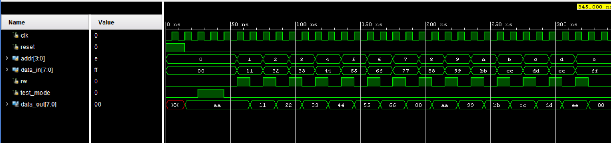
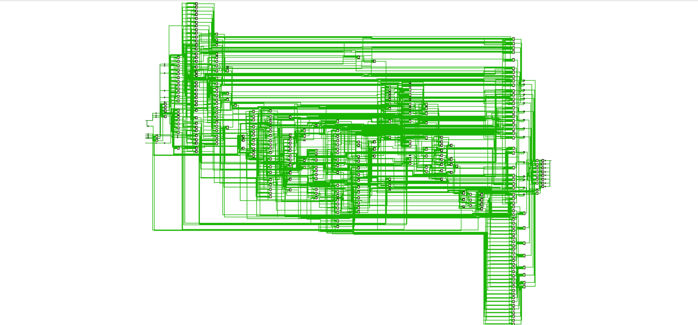
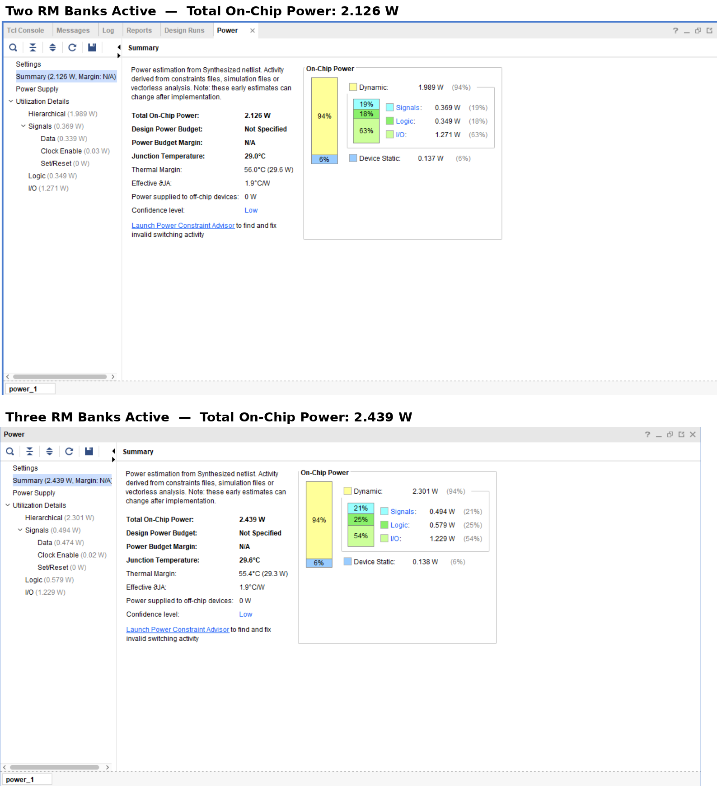

# Power-Efficient Built-In Self-Repair (BISR) for Interleaved Memory

A power-efficient Built-In Self-Repair architecture for interleaved memory, implemented in Verilog and verified on a Xilinx Spartan-7 FPGA using AMD Vivado. Redundant memory banks are powered on only when faults are detected, giving up to **31.3% dynamic-power savings** over always-on redundancy.

## Project Overview

This project implements an on-demand memory self-repair system, including:
- Built-In Self-Test (BIST) for fault detection
- Built-In Redundancy Analysis (BIRA) for storing and matching faulty addresses
- On-demand redundant memory (RM) banks gated by a power-switch controller
- Support for both high-order and low-order interleaving

## Architecture
4-bit addr → [ Address Splitter ] → high-order / low-order lines
│
[ BIST ] → [ BIRA ] → [ Power Switch Controller ]
│ │
▼ ▼
[ Main Memory Banks ] [ Redundant Memory Banks ]
(interleaved) (on-demand)
│ │
└───────→ [ MUX ] ←──┘ → 8-bit data_out

## Module Structure

| Block | Role |
|-------|------|
| Main Memory Banks | Interleaved memory for parallel access |
| Redundant Memory (RM) Banks | Spares that replace faulty cells, activated on demand |
| BIST Module | Tests memory and identifies faulty addresses |
| BIRA Module | Stores faulty addresses and matches them at runtime |
| Address Splitter | Splits the address bus for interleaving |
| Power Switch Controller | Powers RM banks only when needed |
| Multiplexers / Decoders | Route data and addresses between main and redundant memory |
| Design file | `testing_bisr.v` |
| Testbench | `testing_tb.v` |

## Fault Injection & Repair Results

| Address | Written | Read back | Status |
|---------|---------|-----------|--------|
| 0x1 – 0x6 | 0x11 – 0x66 | same | OK (main memory) |
| **0x7 (0111)** | 0x77 | 0x00 | Faulty → rerouted to RM |
| 0x8 – 0xD | 0x88 – 0xEE | same | OK (main memory) |
| **0xE (1110)** | 0xFF | 0x00 | Faulty → rerouted to RM |

## Simulation Results

## Power Analysis

| Scenario | Total On-Chip Power | Dynamic Power |
|----------|--------------------|----------------|
| Two RM banks active | 2.126 W | 1.989 W (94%) |
| Three RM banks active | 2.439 W | 2.301 W (94%) |

## Tools Used

- **Language:** Verilog HDL
- **Simulator / Synthesis:** AMD Vivado 2023.2
- **Target Device:** Xilinx Spartan-7 FPGA

## Key Concepts Implemented

### Built-In Self-Test (BIST)
Generates test patterns (LFSR-based) and compares memory responses against expected values to flag faulty addresses.

### Built-In Redundancy Analysis (BIRA)
Stores faulty addresses and continuously compares incoming addresses against them during normal operation.

### On-Demand Redundant Memory
Unlike conventional BISR that keeps all spare banks powered, RM banks are enabled only when a faulty address is accessed — the key source of the power savings.

### Memory Interleaving
Supports high-order (block) and low-order (address) interleaving to spread accesses across banks and improve throughput.

## How to Run

1. Open AMD Vivado 2023.2 (or later)
2. Create a new RTL project targeting a Spartan-7 device
3. Add `testing_bisr.v` as a Design Source
4. Add `testing_tb.v` as a Simulation Source
5. Run Behavioral Simulation and inspect the waveform
6. Run Synthesis, then open Report Power for the on-chip power breakdown

## Author

**Shruddha Metri**

Developed as part of an M.Tech VLSI Design & Embedded Systems project.
